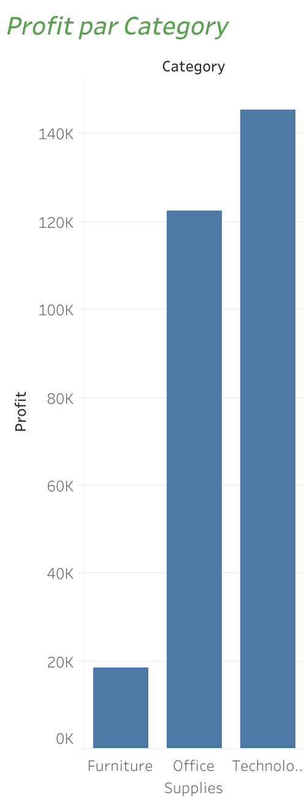
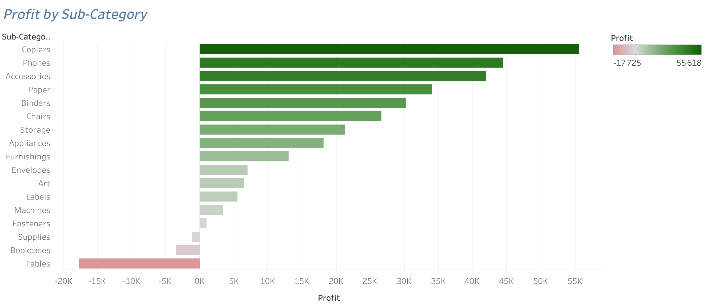
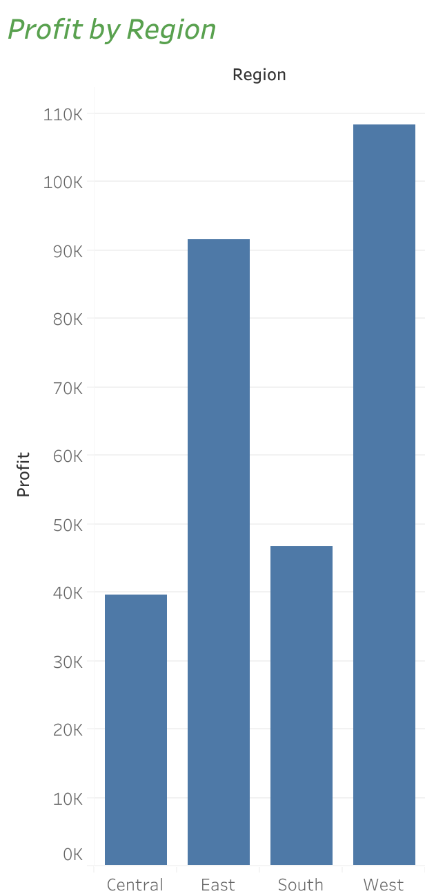
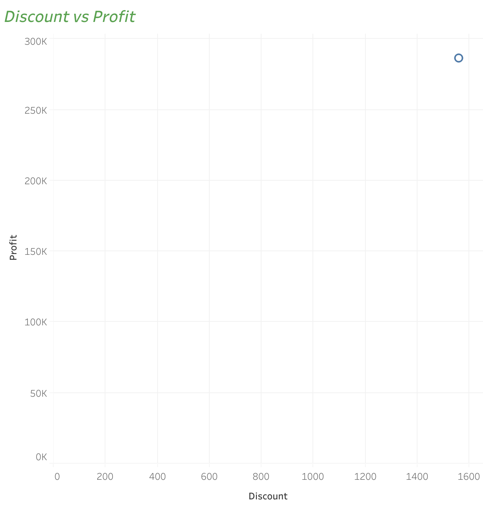

# 📊 Analyse des données e-commerce

##  Objectif
Ce projet vise à analyser les données de ventes d’un e-commerce afin d’identifier les facteurs de rentabilité, détecter les produits non performants et proposer des recommandations stratégiques.

##  Outils utilisés
- SQL (mysql-workbench-community)
- Excel
- Tableau

##  Description des données
Le dataset contient 9995 lignes et 13 variables :

- Sales (ventes)
- Profit
- Discount (réduction)
- Category & Sub-Category
- Region
- Segment client

### Tableau de bord

### Vue globale

### Profit par catégorie

### Profit par sous-catégorie

### Profit par région

### Discount vs Profit

##  Résultats principaux
- Les fortes réductions impactent négativement la rentabilité
- Certains produits (ex : Tables) génèrent des pertes
- La catégorie Technology est la plus rentable
- Les performances varient selon les régions

## Recommandations
- Réduire les remises élevées
- Se concentrer sur les produits rentables
- Revoir les produits déficitaires
- Adapter les stratégies selon les régions

##  Structure du projet
- Dossier dashboard : visualisations
- Fichier SQL : requêtes d’analyse
- analysis.md : analyse détaillée
- key_findings.md : synthèse des résultats

---

##  Conclusion
Ce projet met en évidence l’importance de la stratégie de prix et du choix des produits dans la rentabilité globale.
