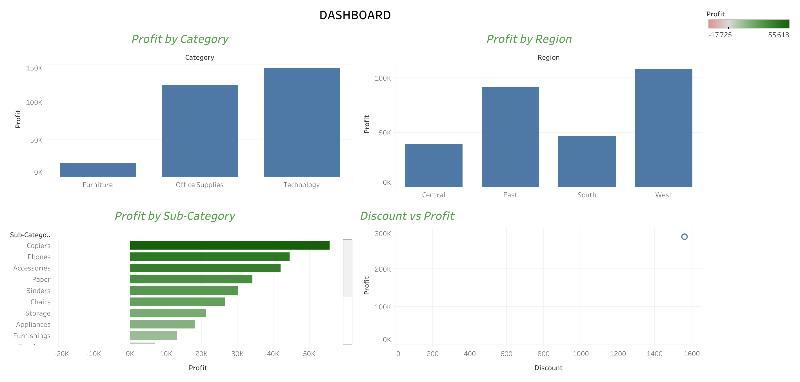

# Analyse des données e-commerce

## Performance globale

L’analyse globale des données montre une activité commerciale importante avec :

- Un chiffre d’affaires total d’environ 2,29 millions
- Un profit global de 286 000
- Un taux moyen de réduction de 16 %

L’entreprise est donc rentable, mais cette rentabilité reste modérée au regard du volume des ventes.

Cela suggère que certaines pratiques, notamment les politiques de réduction, peuvent affecter négativement les marges.

Implications commerciales :
L’entreprise doit surveiller de près ses stratégies de pricing afin de protéger sa rentabilité, notamment en limitant les remises excessives.

# Analyse des catégories

L’analyse par catégorie met en évidence des performances contrastées :

- Technology génère le plus de profit
- Office Supplies affiche également de bonnes performances
- Furniture présente un profit très faible malgré un volume de ventes élevé

Cela indique une inefficacité dans la catégorie Furniture, où les ventes ne se traduisent pas en profit.

Implications commerciales :
L’entreprise devrait revoir sa stratégie sur les produits Furniture :
- ajustement des prix
- réduction des coûts
- ou optimisation des promotions

# Analyse des sous-catégories

L’analyse détaillée révèle des écarts importants entre les produits :

- Accessories est l’une des sous-catégories les plus rentables
- Tables génère des pertes significatives (-17K)

Cela montre que certains produits contribuent positivement à la performance, tandis que d’autres détruisent de la valeur.

Implications commerciales :
Il est essentiel de :
- identifier les produits non rentables
- revoir leur stratégie commerciale
- voire les retirer du catalogue si nécessaire

# Impact des réductions

L’analyse du lien entre les réductions et le profit montre une tendance claire :

- Les faibles réductions (0 à 10 %) maintiennent un profit positif
- Les fortes réductions (supérieures à 30 %) entraînent des pertes

Cela met en évidence une relation négative entre discount élevé et rentabilité.

Implications commerciales :
L’entreprise devrait :
- limiter les remises importantes
- privilégier des stratégies promotionnelles plus ciblées
- optimiser les marges plutôt que stimuler les ventes à perte

# Analyse régionale

Les performances varient selon les régions :

- West est la région la plus rentable
- East affiche de bonnes performances
- Central est la moins performante

Ces écarts montrent que le marché n’est pas homogène.

Implications commerciales :
Il est recommandé de :
- renforcer les investissements dans les régions performantes
- analyser les causes de sous-performance dans les zones faibles
- adapter les stratégies marketing par région

## Conclusion générale

L’analyse met en évidence plusieurs points clés :

- Une rentabilité globale positive mais fragile
- Un impact négatif des fortes réductions
- Des écarts importants de performance entre produits
- Une forte concentration des ventes sur certains produits
- Des disparités régionales significatives

Ces résultats montrent que l’entreprise peut améliorer sa performance en :

- optimisant sa stratégie de prix
- se concentrant sur les produits rentables
- réduisant les pertes liées à certains articles
- adaptant sa stratégie selon les régions
